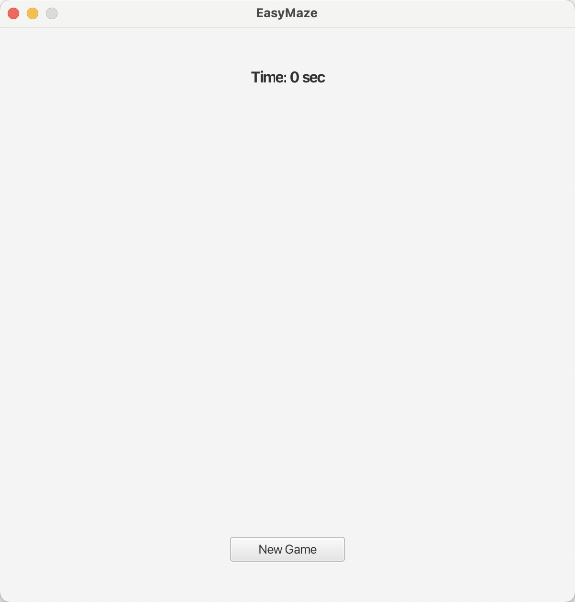
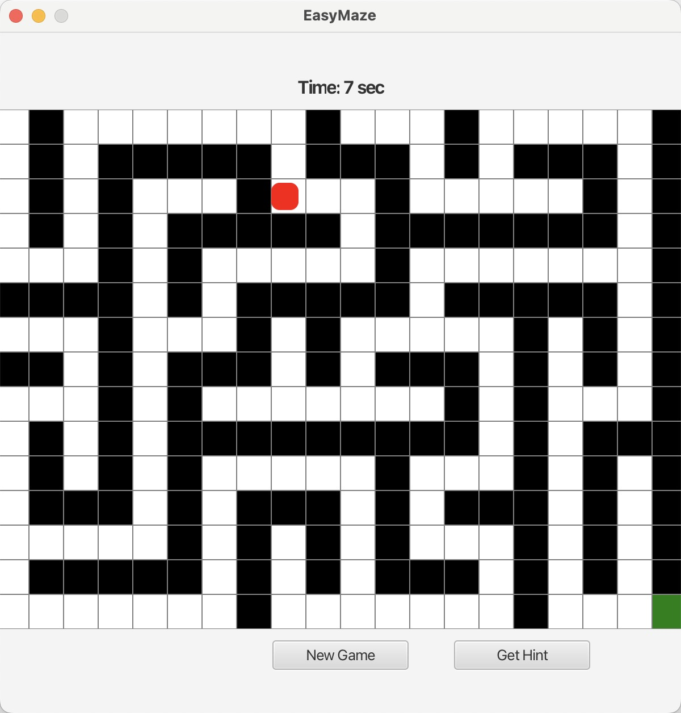
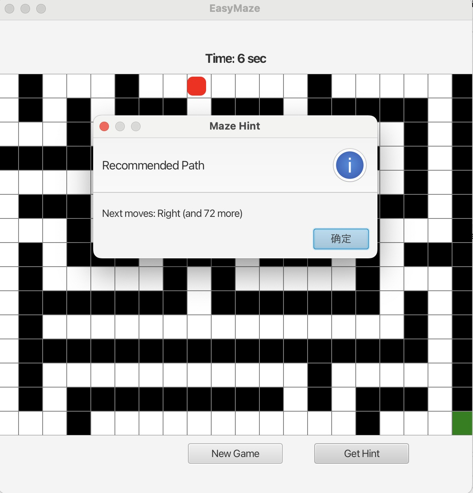
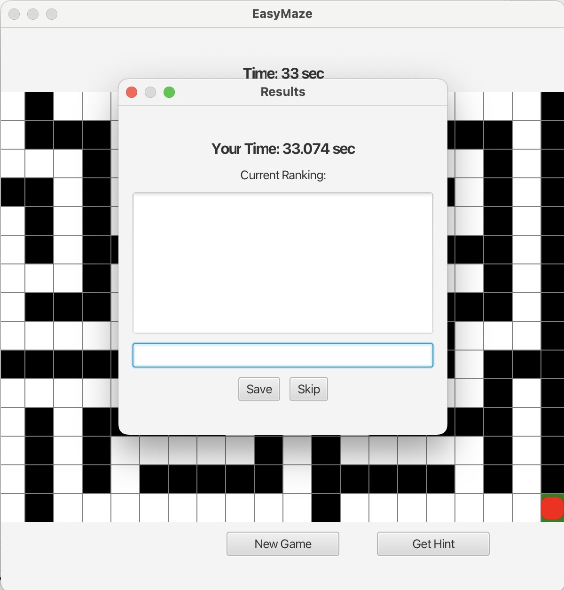
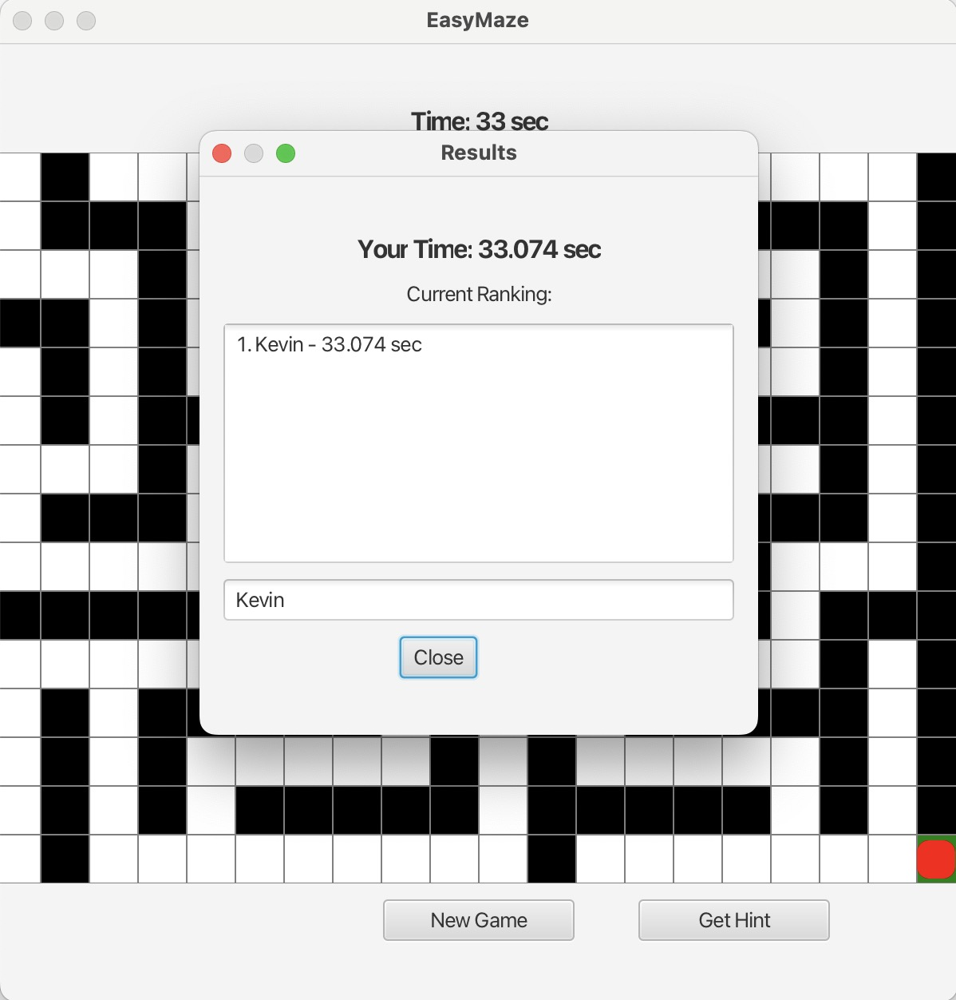

# EasyMaze
## About The Project
EasyMaze is a maze game based on Java and JavaFX. Players use keyboard controls to navigate through randomly generated mazes, with the goal of reaching the end as quickly as possible. The game includes a timer, a hint system, and a leaderboard.

## Getting Started
### Prerequisites
* Java: Version 17 or higher.
* JavaFX: Ensure JavaFX SDK is installed and configured.
* IDE: Eclipse (Recommended), IntelliJ IDEA, or any IDE supporting JavaFX projects.
* Maven/Gradle: Optional for dependency management.

### Installation
1. Clone the Repository
    ```
    git clone https://github.com/LinNEUdash/INFO6205_Final_Project.git
    ```
2. Open Eclipse, `File` > `Import...` > `General` > ` Existing Projects into Workspace`, Import `EasyMaze` into Eclipse.

### Configuration
* Add the JavaFX library to your project:
    * For IntelliJ: `File` > `Project Structure` > `Libraries` > `Add JavaFX lib folder`.
    * For Eclipse: Right-click project > `Build Path` > `Add External Archive`s > Select JavaFX lib jars.
* Alternatively, use a build tool like Maven:
    ```
    <dependency>
        <groupId>org.openjfx</groupId>
        <artifactId>javafx-controls</artifactId>
        <version>17</version>
    </dependency>
    ```
> ⚠️ **Note for Java 8 users**:  
> If you're using JavaFX via the old `jfxrt.jar` (bundled with Java 8), please refer to the following steps on Eclipse:
> 1. Right-click project and choose `Properties`.
> 2. In the left pane, select `Java Build Path`.
> 3. Under the `Libraries`, select `Modulepath`, then click `Add External JARs...`
> 4. Locate and select all the `.jar` files in the `javafx-sdk-**/lib` folder from your local JavaFX SDK.
> 5. Switch to the `Order and Export tab`, check the box next to the newly added `jfxrt.jar`, and move it to the top of the list.
> 6. `Apply and Close`


### Compile and Run
* Ensure your IDE is set to use Java 17+.
* Add VM options to run JavaFX:
    ```
    --module-path /path/to/javafx-sdk/lib --add-modules javafx.controls,javafx.fxml
    ```
* Run MazeApplication.java as the main class.
> ⚠️ **Note for Java 8 users**:  
> If you're using JavaFX via the old `jfxrt.jar` (bundled with Java 8), please refer to the following steps on Eclipse:
> 1. Right-click the project and select `Run As` > `Java Application...`
> 2. Under `(x)= Arguments`, Add VM options:<br>
    ```
    --add-modules javafx.controls,javafx.fxml
    ```
> 3. Uncheck `use the -XstartOnFirstThread argument when launching with SWT` and `use the -XX:+ShowCodeDetailsInExceptionMessages argument when launching`
> 4. `Run`

## Usage
1. Start the Game:
    * Click the "New Game" button to generate a maze.
    
2. Navigate the Maze:
    * Use `W/Up`, `A/Left`, `S/Down`, `D/Right` to move the red square.
    * Reach the green square to complete the maze.
    
3. Get a Hint:
    * Click `Get Hint` to see the next recommended move.
    
4. View Results:
    * After completing the maze, your completion time and leaderboard will be displayed.
    * Enter your name (optional) to save your time or skip.
    * The Leaderboard will be updated if you fill in your name.
    
    

## Contact
Yuxiao Lin - [@Linkedin](https://www.linkedin.com/in/yuxiao-lin-neu/) - [lin.yuxia@northeastern.edu](mailto:lin.yuxia@northeastern.edu)